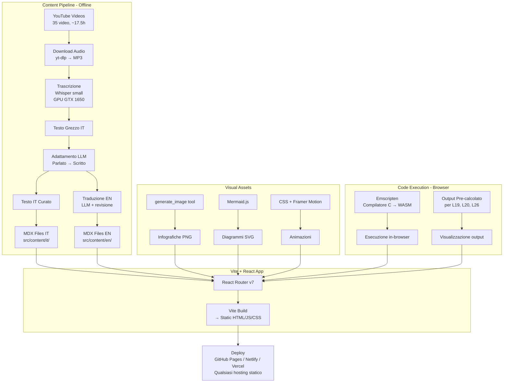

# Piattaforma Didattica C — Corso di Salvatore Sanfilippo (antirez)

> Piattaforma web bilingue (IT/EN) che trasforma il corso YouTube di programmazione C di Salvatore Sanfilippo in un'esperienza di apprendimento interattiva completa con testi, infografiche, animazioni, esercizi e giochi didattici.

---

## 1. Catalogo Completo del Corso

**Playlist YouTube:** [Corso di programmazione in C](https://www.youtube.com/playlist?list=PLrEMgOSrS_3cFJpM2gdw8EGFyRBZOyAKY)
**Autore:** Salvatore Sanfilippo (antirez) — creatore di [Redis](https://redis.io/)
**Totale:** 35 video — **~17 ore 30 minuti** di contenuto

### 1.1 Lezioni Principali (31 lezioni)

| Lezione | Pos. Playlist | Titolo | Link | Durata |
|---------|---------------|--------|------|--------|
| L1 | #1 | Introduzione al C | [▶ YouTube](https://www.youtube.com/watch?v=HjXBXBgfKyk) | 22:00 |
| L2 | #2 | Variabili, tipi, printf | [▶ YouTube](https://www.youtube.com/watch?v=Z84vlG1RRtg) | 20:40 |
| L3 | #4 | Funzioni | [▶ YouTube](https://www.youtube.com/watch?v=mw4gUqsGPZw) | 25:38 |
| L4 | #5 | Array e stringhe | [▶ YouTube](https://www.youtube.com/watch?v=YNsXyasn4R4) | 27:49 |
| L5 | #6 | Operatori ed espressioni | [▶ YouTube](https://www.youtube.com/watch?v=SWWHqgSwQFw) | 25:52 |
| L6 | #7 | IF, GOTO e Ricorsione | [▶ YouTube](https://www.youtube.com/watch?v=lc7aYXNl1T8) | 30:38 |
| L7 | #8 | Ricorsione, while/for, switch | [▶ YouTube](https://www.youtube.com/watch?v=HCRthhjbfAg) | 30:35 |
| L8 | #9 | Conway's Game of Life (progetto) | [▶ YouTube](https://www.youtube.com/watch?v=c5atNuYdKK8) | 53:48 |
| L9 | #10 | Introduzione ai Puntatori | [▶ YouTube](https://www.youtube.com/watch?v=BBgZs-jd_QY) | 17:07 |
| L10 | #11 | La Matematica dei Puntatori | [▶ YouTube](https://www.youtube.com/watch?v=lc7hL9Wt-ho) | 28:20 |
| L11 | #12 | Chiarimenti sui puntatori | [▶ YouTube](https://www.youtube.com/watch?v=msGzuneFpDU) | 21:27 |
| L12 | #13 | Primo incontro con Malloc() | [▶ YouTube](https://www.youtube.com/watch?v=ZkaKwWXJXs8) | 27:27 |
| L13 | #14 | Metadata nascosta dietro il trucco del puntatore | [▶ YouTube](https://www.youtube.com/watch?v=9AhaOdEBmPc) | 15:19 |
| L14 | #15 | Strutture C | [▶ YouTube](https://www.youtube.com/watch?v=p4IMHau2lq8) | 34:16 |
| L15 | #16 | Struct come building block delle strutture dati | [▶ YouTube](https://www.youtube.com/watch?v=aTT2W5NACEY) | 26:09 |
| L16 | #17 | Strutture nella String Library con Reference Counting | [▶ YouTube](https://www.youtube.com/watch?v=VPs_QtlLNcs) | 23:38 |
| L17 | #18 | Strutture, Design Choices, Hexdump() | [▶ YouTube](https://www.youtube.com/watch?v=grkIJjw6o18) | 37:56 |
| L18 | #21 | Tipi opachi, typedef, file della libreria standard | [▶ YouTube](https://www.youtube.com/watch?v=3w73xjUSUEU) | 22:01 |
| L19 | #22 | System Calls | [▶ YouTube](https://www.youtube.com/watch?v=QWLJ7CBAu_I) | 22:42 |
| L20 | #23 | Buffering della libc e file mappati in memoria | [▶ YouTube](https://www.youtube.com/watch?v=yKavhObop5I) | 36:06 |
| L21 | #24 | Union e Bitfield | [▶ YouTube](https://www.youtube.com/watch?v=TM4jgODgdFY) | 28:38 |
| L22 | #25 | Function Pointers | [▶ YouTube](https://www.youtube.com/watch?v=OIseV5lcx8w) | 25:17 |
| L23 | #26 | Toy Forth Interpreter (Parte 1) | [▶ YouTube](https://www.youtube.com/watch?v=vYODKK8TQGE) | 39:06 |
| L24 | #27 | Toy Forth Interpreter (Parte 2) | [▶ YouTube](https://www.youtube.com/watch?v=-QxrmHo-V7Y) | 55:06 |
| L25 | #28 | Toy Forth Interpreter (Parte 3) | [▶ YouTube](https://www.youtube.com/watch?v=-1ZhCgaIPOk) | 20:42 |
| L26 | #29 | Toy Forth, le complessità di exec() (Parte 4) | [▶ YouTube](https://www.youtube.com/watch?v=oMj3N6jYIUU) | 38:39 |
| L27 | #30 | Toy Forth, registrazione funzioni (Parte 5) | [▶ YouTube](https://www.youtube.com/watch?v=C4AHEK3fSjg) | 44:55 |
| L28 | #32 | Funzioni con numero variabile di argomenti | [▶ YouTube](https://www.youtube.com/watch?v=cvWbCx0lLjs) | 31:03 |
| L29 | #33 | ToyForth, esecuzione primo programma | [▶ YouTube](https://www.youtube.com/watch?v=nHzlRqPnlrE) | 47:41 |
| L30 | #34 | Evolvere un'immagine per lo ZX Spectrum (Parte 1) | [▶ YouTube](https://www.youtube.com/watch?v=D1U3uCe-kok) | 47:52 |
| L31 | #35 | Evolvere un'immagine per lo ZX Spectrum (Parte 2) | [▶ YouTube](https://www.youtube.com/watch?v=fZmdsh0gQig) | 44:15 |

**Durata lezioni principali: ~16 ore 14 minuti**

### 1.2 Appendici e Episodi Speciali (4 video)

| ID | Pos. Playlist | Titolo | Link | Durata | Collegamento |
|----|---------------|--------|------|--------|-------------|
| A1 | #3 | Appendice alla L2: La vita delle variabili locali | [▶ YouTube](https://www.youtube.com/watch?v=r6mU_IHXEps) | 22:06 | Dopo L2 |
| S1 | #19 | Episodio speciale: Come recuperare algoritmi dalla memoria | [▶ YouTube](https://www.youtube.com/watch?v=soiBgJjAmP8) | 22:26 | Dopo L17 |
| S2 | #20 | Variabili random (mini-episodio) | [▶ YouTube](https://www.youtube.com/watch?v=HzBqda0Jg3E) | 02:45 | Dopo S1 |
| S3 | #31 | Deep Dive nel Reference Counting | [▶ YouTube](https://www.youtube.com/watch?v=QdZc1JV_oCw) | 11:33 | Dopo L27 |

**Durata contenuti extra: ~58 minuti**

### 1.3 Mappa Progressione Concetti

```mermaid
graph LR
    subgraph "Fondamenti L1-L5"
        L1["L1: Intro C<br>hello world"] --> L2["L2: Variabili<br>tipi base"]
        L2 --> A1["A1: Vita variabili<br>locali"]
        A1 --> L3["L3: Funzioni"]
        L3 --> L4["L4: Array<br>stringhe"]
        L4 --> L5["L5: Operatori<br>espressioni"]
    end

    subgraph "Controllo Flusso L6-L8"
        L5 --> L6["L6: IF, GOTO<br>Ricorsione"]
        L6 --> L7["L7: While, For<br>Switch"]
        L7 --> L8["L8: Game of Life<br>Progetto pratico"]
    end

    subgraph "Puntatori L9-L13"
        L8 --> L9["L9: Intro<br>Puntatori"]
        L9 --> L10["L10: Matematica<br>Puntatori"]
        L10 --> L11["L11: Chiarimenti"]
        L11 --> L12["L12: Malloc"]
        L12 --> L13["L13: Metadata<br>Trick"]
    end

    subgraph "Strutture L14-L17"
        L13 --> L14["L14: C Structs"]
        L14 --> L15["L15: Data<br>Structures"]
        L15 --> L16["L16: String Lib<br>Ref Count"]
        L16 --> L17["L17: Design<br>Choices"]
    end

    subgraph "Avanzato L18-L22"
        L17 --> S1["S1: Algoritmi<br>dalla memoria"]
        S1 --> L18["L18: Opaque Types<br>Typedef"]
        L18 --> L19["L19: System Calls"]
        L19 --> L20["L20: Buffering<br>mmap"]
        L20 --> L21["L21: Unions<br>Bitfields"]
        L21 --> L22["L22: Function<br>Pointers"]
    end

    subgraph "Toy Forth L23-L29"
        L22 --> L23["L23: Forth P1"]
        L23 --> L24["L24: Forth P2"]
        L24 --> L25["L25: Forth P3"]
        L25 --> L26["L26: Forth P4"]
        L26 --> L27["L27: Forth P5"]
        L27 --> S3["S3: Deep Dive<br>Ref Counting"]
        S3 --> L28["L28: Variadic<br>Functions"]
        L28 --> L29["L29: Forth Run"]
    end

    subgraph "Progetto Finale L30-L31"
        L29 --> L30["L30: ZX Spectrum<br>P1"]
        L30 --> L31["L31: ZX Spectrum<br>P2"]
    end
```



---

## 2. Decisioni Finali Confermate ✅

> [!IMPORTANT]
> Queste decisioni sono state discusse e confermate dall'utente il 07/03/2026.

### 2.1 Stack Tecnologico

| Componente | Scelta Finale | Motivazione |
|-----------|---------------|-------------|
| **Framework** | **Vite + React** | L'utente lo conosce già; più semplice e veloce di Next.js |
| **Linguaggio** | **TypeScript** | Type safety, migliore DX |
| **Styling** | **CSS Vanilla + CSS Custom Properties** | Massima flessibilità, no dipendenze CSS |
| **Contenuti** | **MDX** (via `@mdx-js/rollup`) | Markdown + componenti React interattivi inline |
| **Routing** | **React Router v7** | Navigazione SPA, route parametriche per lezioni |
| **Diagrammi** | **Mermaid.js** + SVG custom | Diagrammi tecnici renderizzati client-side |
| **Animazioni** | **CSS Animations + Framer Motion** | CSS per micro-animazioni, Framer per animazioni complesse |
| **Syntax Highlighting** | **Shiki** | Highlighting codice C con temi personalizzati, supporto WASM |
| **i18n** | **react-i18next** | Supporto bilingue IT/EN |
| **Icone** | **Lucide React** | Set moderno, tree-shakeable |
| **Fonts** | **Google Fonts** (Inter + JetBrains Mono) | Inter per il testo, JetBrains Mono per il codice |

#### Perché Vite + React e NON Next.js

| Criterio | Next.js | Vite + React |
|----------|---------|-------------|
| Familiarità utente | ❌ No | ✅ Sì |
| Velocità sviluppo | 🟡 Più lento (HMR, build) | ✅ Più veloce |
| Complessità | 🔴 Server components, app router, RSC | ✅ Semplice, paradigma classico |
| SSG | ✅ Nativo | 🟡 Non strettamente necessario per SPA |
| Deploy | Vercel-centric | ✅ Ovunque (output = file statici) |

### 2.2 Esecuzione Codice C nel Browser

| Livello | Metodo | Dettaglio Tecnico | Copertura |
|---------|--------|-------------------|-----------|
| **Primario** | **Emscripten (C→WASM precompilato)** | Compilatore Clang/LLVM compilato a WASM, esegue C nel browser senza server | ~90% degli esercizi |
| **Eccezioni** | **Output pre-calcolato** | Per `open()`, `read()`, `write()`, `mmap()`, `fork()`, `exec()` | Lezioni L19, L20, L26 |
| **Nessun fallback API** | ❌ | Né Judge0 né Wandbox | — |

> [!NOTE]
> **Perché Emscripten e nessun fallback API esterno?**
> - **Emscripten** è lo standard industriale per compilare C→WASM (usato da Unity, Qt, FFmpeg, SQLite nel browser)
> - Funziona **100% offline** — nessuna dipendenza da servizi terzi
> - Il corso copre C fondamentale (variabili, puntatori, struct, malloc, loop, ricorsione) che WASM gestisce perfettamente
> - **Wandbox** potrebbe chiudere senza preavviso (servizio giapponese senza SLA)
> - **Judge0** richiede API key e ha limiti (50 req/giorno free)
> - Per le 2-3 lezioni su system calls, l'output pre-calcolato è didatticamente sufficiente

**Implementazione tecnica:** Useremo un compilatore C→WASM precompilato (es. un build di `clang` compilato con Emscripten stesso, oppure librerie come [`pce`](https://github.com/nickoala/pce) o un approccio custom). Il compilatore viene caricato lazy nel browser (~2-5 MB), cachato in `localStorage`/`IndexedDB`, e permette di compilare ed eseguire snippet C direttamente nella pagina.

### 2.3 Trascrizione Audio

| Parametro | Scelta Finale | Note |
|-----------|---------------|------|
| **Strumento** | OpenAI Whisper, modello **`small`** | 244M parametri, buon rapporto qualità/velocità |
| **Hardware** | GPU locale — **NVIDIA GTX 1650** | 4 GB VRAM, CUDA 13.0, driver 580.126.09 |
| **VRAM richiesta** | ~2 GB | Compatibile (4 GB disponibili, ~0.6 GB usati dal sistema) |
| **Velocità stimata** | ~4-6x realtime su GPU | ~22 min di video → ~4-5 min di trascrizione |
| **Lingua** | Italiano (`language="it"`) | Con code-switching automatico per termini inglesi |
| **Upgrade path** | Se qualità insufficiente: 1) `medium` su CPU (5 GB RAM) 2) Whisper API cloud (~$0.006/min ≈ $6.30 totali) | Decisione dopo test su L1 |

### 2.4 Adattamento Testo e Traduzione

| Fase | Strumento | Dettagli |
|------|-----------|----------|
| **Adattamento IT** (parlato → scritto) | LLM (Claude/GPT) con prompt specializzati | Rimuovere filler, ristrutturare in sezioni, mantenere tono di Salvatore |
| **Traduzione EN** | LLM (Claude/GPT) con prompt per traduzione tecnica | Terminologia C universale (pointer, malloc, struct restano in inglese anche in EN) |
| **Revisione** | Manuale | Verifica accuratezza tecnica, naturalezza, cross-referencing |

### 2.5 Approccio di Sviluppo

| Fase | Strategia | Criterio di avanzamento |
|------|-----------|------------------------|
| **MVP** | **Lezione 1 completa** come proof-of-concept | Tutti i componenti funzionanti per una lezione |
| **Iterazione** | Perfezionare su L1 finché l'utente non è soddisfatto | Approvazione esplicita dell'utente |
| **Scaling** | Applicare la pipeline a tutte le 34 lezioni rimanenti | Solo dopo approvazione MVP |

---

## 3. Architettura del Progetto

### 3.1 Struttura Directory

```
/home/clod/Desktop/c/
├── docs/                        # Documentazione progetto
│   ├── implementation_plan.md   # Questo file
│   ├── walkthrough.md           # Riepilogo lavoro svolto
│   └── task.md                  # Checklist fasi
├── public/
│   ├── images/
│   │   ├── infographics/        # Infografiche generate (PNG/SVG)
│   │   └── diagrams/            # Diagrammi export SVG
│   ├── wasm/                    # Compilatore C WASM precompilato
│   └── fonts/                   # Font locali (fallback)
├── src/
│   ├── main.tsx                 # Entry point React + ReactDOM
│   ├── App.tsx                  # App wrapper con Router + i18n Provider
│   ├── router.tsx               # Configurazione React Router v7
│   ├── pages/
│   │   ├── Home.tsx             # Homepage con panoramica corso
│   │   ├── LessonIndex.tsx      # Indice di tutte le lezioni con progresso
│   │   ├── Lesson.tsx           # Pagina singola lezione (parametrica: /lesson/:slug)
│   │   └── NotFound.tsx         # 404
│   ├── components/
│   │   ├── layout/
│   │   │   ├── Header.tsx       # Logo, nav, language toggle, theme toggle
│   │   │   ├── Sidebar.tsx      # Indice lezioni con stato completamento
│   │   │   ├── Footer.tsx       # Credits, link a Salvatore, copyright
│   │   │   └── LessonNav.tsx    # Navigazione prev/next lezione
│   │   ├── content/
│   │   │   ├── CodeBlock.tsx    # Syntax highlighting con Shiki + bottone copia
│   │   │   ├── Diagram.tsx      # Wrapper Mermaid con rendering lazy
│   │   │   ├── Infographic.tsx  # Immagine/SVG interattivo con zoom
│   │   │   ├── KeyConcepts.tsx  # Cards animate con riassunto concetti
│   │   │   ├── Animation.tsx    # Wrapper per animazioni didattiche Framer Motion
│   │   │   └── VideoEmbed.tsx   # Embed YouTube responsive con privacy-mode
│   │   ├── exercises/
│   │   │   ├── MultipleChoice.tsx  # Quiz a scelta multipla con feedback
│   │   │   ├── CodeEditor.tsx      # Editor codice C con esecuzione WASM
│   │   │   ├── FillTheGaps.tsx     # Codice con spazi vuoti da completare
│   │   │   ├── DragAndDrop.tsx     # Riordina istruzioni (HTML5 DnD API)
│   │   │   └── OutputPredict.tsx   # "Cosa stampa questo codice?"
│   │   └── games/
│   │       ├── TypeMatcher.tsx     # Abbina tipi C e valori (per L1-L5)
│   │       ├── PointerMaze.tsx     # Naviga seguendo i puntatori (per L9-L11)
│   │       ├── MemoryAllocator.tsx # Simula malloc/free (per L12-L13)
│   │       ├── StackSimulator.tsx  # Visualizza stack chiamate (per L2, L6-L7)
│   │       ├── StructBuilder.tsx   # Costruisci struct visualmente (per L14-L17)
│   │       ├── GameOfLife.tsx      # Conway's GoL interattivo (per L8)
│   │       ├── ForthREPL.tsx       # Mini interprete Forth (per L23-L29)
│   │       └── BitfieldPuzzle.tsx  # Manipola bit visualmente (per L21)
│   ├── content/                 # File MDX delle lezioni
│   │   ├── it/
│   │   │   ├── lesson-01.mdx   # Lezione 1 in italiano
│   │   │   ├── lesson-02.mdx
│   │   │   └── ...             # Una per ogni lezione
│   │   └── en/
│   │       ├── lesson-01.mdx   # Lezione 1 in inglese
│   │       ├── lesson-02.mdx
│   │       └── ...
│   ├── data/
│   │   └── lessons.ts          # Array con metadati: titolo, slug, videoId, argomenti, durata
│   ├── i18n/
│   │   ├── it.json             # Traduzioni UI italiana
│   │   ├── en.json             # Traduzioni UI inglese
│   │   └── config.ts           # Setup react-i18next
│   ├── hooks/
│   │   ├── useProgress.ts      # Hook per tracciare progresso (localStorage)
│   │   └── useWasmCompiler.ts  # Hook per compilare/eseguire C via WASM
│   ├── lib/
│   │   ├── wasm-compiler.ts    # Wrapper basso livello per il compilatore C WASM
│   │   ├── mdx-loader.ts       # Utility per caricare file MDX dinamicamente
│   │   └── utils.ts            # Helpers generici
│   └── styles/
│       ├── design-tokens.css   # Variabili CSS: colori, spacing, radius, shadows
│       ├── typography.css      # Font-face, scale tipografica, stili testo
│       ├── components.css      # Stili specifici per componenti
│       ├── animations.css      # Keyframes e classi animazione
│       └── index.css           # Import globale + reset + base styles
├── scripts/                     # Script Python per content pipeline
│   ├── transcribe.py           # Download audio (yt-dlp) + trascrizione (Whisper)
│   ├── adapt-text.py           # Prompt LLM per adattamento parlato→scritto
│   └── requirements.txt        # Dipendenze Python: whisper, yt-dlp, openai
├── transcriptions/              # Output trascrizioni (non committato)
│   ├── raw/                    # Trascrizioni grezze da Whisper
│   └── adapted/               # Testi adattati pronti per MDX
├── index.html                   # Entry point HTML per Vite
├── package.json
├── vite.config.ts               # Config Vite con plugin MDX
├── tsconfig.json
└── README.md
```

### 3.2 Diagramma Architettura



---

## 4. Pipeline dei Contenuti (dettaglio tecnico)

### 4.1 Step 1: Download Audio

```bash
# Installazione
pip install yt-dlp

# Download singolo video (esempio L1)
yt-dlp -x --audio-format mp3 -o "transcriptions/raw/lesson-01.%(ext)s" \
  "https://www.youtube.com/watch?v=HjXBXBgfKyk"

# Download TUTTI i video della playlist
yt-dlp -x --audio-format mp3 -o "transcriptions/raw/%(playlist_index)s-%(title)s.%(ext)s" \
  "https://www.youtube.com/playlist?list=PLrEMgOSrS_3cFJpM2gdw8EGFyRBZOyAKY"
```

### 4.2 Step 2: Trascrizione con Whisper

```python
# scripts/transcribe.py
import whisper
import json
import os

def transcribe_lesson(audio_path, output_path):
    """Trascrive un file audio con Whisper small su GPU."""
    model = whisper.load_model("small", device="cuda")  # GTX 1650, ~2 GB VRAM
    
    result = model.transcribe(
        audio_path,
        language="it",           # Lingua principale
        task="transcribe",       # Non tradurre, trascrivere in italiano
        verbose=True,            # Mostra progresso
        word_timestamps=True,    # Timestamp per ogni parola (utile per revisione)
    )
    
    # Salva testo completo
    with open(output_path + ".txt", "w") as f:
        f.write(result["text"])
    
    # Salva con timestamps per segmento (utile per sincronizzazione)
    with open(output_path + ".json", "w") as f:
        segments = [{"start": s["start"], "end": s["end"], "text": s["text"]} 
                    for s in result["segments"]]
        json.dump(segments, f, indent=2, ensure_ascii=False)
    
    return result["text"]

# Esempio utilizzo
if __name__ == "__main__":
    transcribe_lesson(
        "transcriptions/raw/lesson-01.mp3",
        "transcriptions/raw/lesson-01"
    )
```

**Performance stimata su GTX 1650:**
- 22 minuti di audio → ~4-5 minuti di trascrizione
- 17.5 ore totali → ~3-4 ore di processing (se batch)

### 4.3 Step 3: Adattamento Parlato → Scritto

**Processo in 5 passi:**

1. **Pulizia** — Rimuovere "ehm", "allora", ripetizioni, falsi inizi
2. **Ristrutturazione** — Organizzare in sezioni con titoli (h2, h3)
3. **Codice** — Estrarre tutti gli snippet di codice e formattarli in code blocks
4. **Tono** — Mantenere lo stile diretto e pratico di Salvatore ("prendiamo un puntatore e vediamo cosa succede...")
5. **Cross-linking** — Aggiungere riferimenti alle lezioni correlate

### 4.4 Step 4: Traduzione EN

- Struttura MDX identica alla versione IT
- Terminologia tecnica C resta in inglese (universale)
- Espressioni idiomatiche italiane di Salvatore adattate culturalmente, non tradotte letteralmente

---

## 5. Strategia Contenuti Multimediali

### 5.1 Diagrammi Tecnici (Mermaid.js)

| Tipo Diagramma | Lezioni dove usarlo | Esempio concreto |
|----------------|---------------------|------------------|
| **Flowchart** | L6 (if/goto), L7 (loop) | Flusso di esecuzione di un programma con if-else |
| **Memory Layout** | L9-L13 (puntatori, malloc) | Visualizzazione stack vs heap, chi punta dove |
| **Data Structure** | L14-L17 (struct) | Layout di una struct in memoria con offset |
| **Sequence Diagram** | L19 (system calls) | Chiamata user space → kernel → hardware |
| **State Diagram** | L8 (Game of Life) | Transizioni di stato delle cellule |
| **Class/Architecture** | L23-L29 (Toy Forth) | Architettura dell'interprete Forth |
| **Bitfield Diagram** | L21 (union/bitfield) | Layout bit dentro una word |

### 5.2 Infografiche

Per ogni lezione, 1-3 infografiche generate con AI (`generate_image` tool) e/o SVG custom:

| Tipo | Esempio | Lezioni |
|------|---------|---------|
| **Cheat sheet** | Tabella tipi C con dimensioni e range | L1-L5 |
| **Confronto side-by-side** | Stack vs Heap, array vs puntatore | L9-L13 |
| **Anatomia** | "Anatomia di una struct" con layout memoria | L14-L17 |
| **Timeline/processo** | Come malloc alloca step-by-step | L12-L13 |
| **Mappa concettuale** | Relazioni tra concetti di una lezione | Tutte |

### 5.3 Animazioni

| Animazione | Tecnologia | Lezione | Descrizione |
|-----------|-----------|---------|-------------|
| Stack growth/shrink | CSS @keyframes | L2, L9 | Rettangoli che si impilano/rimuovono |
| Pointer dereferencing | Framer Motion | L9-L11 | Freccia animata che segue il puntatore |
| Malloc/free | Framer Motion | L12-L13 | Blocchi colorati che appaiono/scompaiono nell'heap |
| Linked list ops | Framer Motion | L14-L15 | Nodi che si collegano con frecce animate |
| Ref counting +/- | CSS counter | L16, S3 | Badge numerico che incrementa/decrementa |
| Game of Life | Canvas/CSS Grid | L8 | Griglia con cellule che nascono/muoiono |
| Forth stack ops | Framer Motion | L23-L29 | Push/pop animati sullo stack Forth |

---

## 6. Esercizi e Giochi Didattici

### 6.1 Tipi di Esercizi (per ogni lezione)

| Tipo | Componente React | Come funziona | Validazione |
|------|-----------------|---------------|-------------|
| **Quiz** | `MultipleChoice.tsx` | 5-10 domande, 4 opzioni, feedback immediato | Client-side, risposta corretta in props |
| **Completa il codice** | `FillTheGaps.tsx` | Codice C con `____` da riempire | Confronto stringa o WASM compilation |
| **Riordina** | `DragAndDrop.tsx` | Righe di codice da mettere in ordine | Confronto con ordine corretto |
| **Trova l'errore** | (variante di CodeEditor) | Codice con bug, identificare la riga | Click sulla riga + spiegazione |
| **Predici output** | `OutputPredict.tsx` | "Cosa stampa?" → input utente → verifica | Confronto con output WASM o pre-calcolato |

### 6.2 Giochi Didattici (componenti standalone)

| Gioco | Componente | Lezioni | Descrizione meccanica |
|-------|-----------|---------|----------------------|
| **Type Matcher** | `TypeMatcher.tsx` | L1-L5 | Drag tipo (int, char, float) su valore corretto. Timer e punteggio. |
| **Pointer Maze** | `PointerMaze.tsx` | L9-L11 | Griglia con celle che contengono indirizzi. Segui la catena di puntatori per trovare il valore finale. |
| **Memory Allocator** | `MemoryAllocator.tsx` | L12-L13 | Interface con heap visuale. Esegui malloc/free nell'ordine corretto senza memory leak. |
| **Stack Simulator** | `StackSimulator.tsx` | L2, L6-L7 | Visualizza lo stack delle chiamate. Passa step-by-step attraverso un programma ricorsivo. |
| **Struct Builder** | `StructBuilder.tsx` | L14-L17 | Drag campi (int, char*, float) in una struct. Mostra padding e allineamento reale. |
| **Game of Life** | `GameOfLife.tsx` | L8 | Versione interattiva: disegna pattern, play/pause, step, velocità. Implementazione in canvas. |
| **Forth REPL** | `ForthREPL.tsx` | L23-L29 | Terminale con mini interprete Forth. Digita comandi, vedi lo stack che cambia. |
| **Bitfield Puzzle** | `BitfieldPuzzle.tsx` | L21 | Toggle bit individuali, vedi come cambiano i valori di union e bitfield. |

---

## 7. Analisi Difficoltà Tecniche e Soluzioni

### 7.1 Trascrizione

| Problema | Severità | Soluzione | Upgrade Path |
|----------|----------|-----------|-------------|
| Code-switching IT/EN (Salvatore mix le lingue) | 🟡 Media | Whisper `small` con `language="it"` + revisione manuale per termini tecnici | — |
| Nomi funzioni/variabili confusi | 🔴 Alta | Post-processing: regex per `camelCase`, `snake_case`, keyword C (`int`, `void`, `printf`, etc.) | Script automatico |
| Qualità `small` insufficiente | 🟡 Media | Testare su L1; se WER troppo alto → upgrade | `medium` su CPU (~5 GB RAM, più lento) oppure Whisper API cloud ($0.006/min) |
| Audio con rumore di fondo | 🟢 Bassa | I video di Salvatore hanno audio pulito (microfono da studio) | — |

### 7.2 Adattamento Testo

| Problema | Severità | Soluzione | Esempio |
|----------|----------|-----------|---------|
| Digressioni (tipiche di Salvatore) | 🟡 Media | Riorganizzarle come callout "💡 Nota di Salvatore" | Aneddoti su Redis, consigli pratici |
| Codice modificato live durante il video | 🔴 Alta | Ricostruire il codice finale; mostrare snapshot progressivi | Versione 1 → Versione 2 → Versione finale |
| Tono/personalità da mantenere | 🟡 Media | Prompt LLM: "Mantieni il tono diretto e pratico, come se spiegassi a un amico programmatore" | — |
| Riferimenti a lezioni precedenti | 🟡 Media | Sistema di cross-linking: `[vedi Lezione 9](/lesson/09)` | — |

### 7.3 Esecuzione C nel Browser (WASM)

| Problema | Severità | Soluzione |
|----------|----------|-----------|
| System calls non supportate | 🟡 Media | Output pre-calcolato con nota "Questo codice richiede un sistema operativo reale" per L19, L20, L26 |
| Download iniziale compilatore (~2-5 MB) | 🟡 Media | Lazy loading al primo uso dell'editor; cache in IndexedDB; skeleton loader durante download |
| Tempo compilazione nel browser | 🟢 Bassa | Per snippet piccoli (<100 righe) è quasi istantaneo; mostrare spinner per compilazioni più lunghe |
| Errori del compilatore poco chiari | 🟡 Media | Mappare errori comuni a messaggi user-friendly in IT/EN |

## Proposed Changes

### Visual Components

#### [NEW] Diagram.tsx (file:///home/clod/Desktop/c/src/components/content/Diagram.tsx)
A component that renders Mermaid.js diagrams to visualize flows (like the compilation process).

#### [NEW] ComparisonTable.tsx (file:///home/clod/Desktop/c/src/components/content/ComparisonTable.tsx)
A styled table component for comparing concepts (e.g., `printf` vs `puts`, or `Header` vs `Source`).

### Content Integration

#### [MODIFY] lesson-01.mdx (file:///home/clod/Desktop/c/src/content/it/lesson-01.mdx)
- Add a compilation flowchart.
- Add a comparison table for function prototypes vs definitions.
- Add an infographic-style block for the preprocessor.

## Verification Plan

### Automated Tests
- Browser verification of diagram rendering.
- Responsive check for tables.

### 7.4 Contenuti Bilingue

| Problema | Severità | Soluzione |
|----------|----------|-----------|
| Sincronizzazione struttura IT/EN | 🟡 Media | Struttura MDX identica; script CI che verifica corrispondenza sezioni |
| Terminologia tecnica | 🟢 Bassa | Universale in C (malloc, pointer, struct, array restano identici in entrambe le lingue) |
| Espressioni idiomatiche di Salvatore | 🟡 Media | Adattamento culturale nella traduzione, non traduzione letterale |

---

## 8. Design e UX

### 8.1 Principi

- **Dark mode di default** con toggle light/dark (CSS custom properties per switch istantaneo)
- **Palette colori:**
  - Dark: sfondo `#0d1117`, superfici `#161b22`, bordi `#30363d`
  - Accenti: verde terminale `#00ff41`, blu elettrico `#3b82f6`, viola `#8b5cf6`
  - Light: sfondo `#ffffff`, superfici `#f6f8fa`, testo `#24292f`
- **Tipografia:** Inter (testo, 16px base) + JetBrains Mono (codice, 14px)
- **Layout:** Sidebar collapsabile (280px) + area contenuto (max 800px) + padding generoso
- **Responsive:** Mobile-first; sidebar diventa drawer su mobile
- **Accessibilità:** ARIA labels, focus visible, keyboard navigation, contrast ratio ≥ 4.5:1

### 8.2 Layout Pagina Lezione

```
┌─────────────────────────────────────────────────────────────┐
│  🔧 Learn C — Corso Interattivo di antirez         [IT|EN] │
│                                               [🌙 / ☀️]    │
├──────────┬──────────────────────────────────────────────────┤
│          │                                                  │
│ SIDEBAR  │  📌 Lezione 9: Introduzione ai Puntatori        │
│ (280px)  │                                                  │
│          │  ─── Sommario ───                                │
│ ▸ Fondamenti│  • Cos'è un puntatore                        │
│   L1 ✅  │  • L'operatore & e *                            │
│   L2 ✅  │  • Puntatori e array                            │
│   A1 ✅  │                                                  │
│   L3 ✅  │  ▶ Video YouTube (embed responsive)             │
│   ...    │                                                  │
│ ▸ Puntatori│ 📝 Testo della Lezione                        │
│   L9 🔵  │  ─────────────────────                          │
│   L10    │  [Contenuto MDX con codice evidenziato,         │
│   L11    │   diagrammi Mermaid renderizzati,               │
│   ...    │   infografiche inline,                          │
│          │   animazioni CSS/Framer Motion]                  │
│ ▸ Avanzato│                                                │
│ ▸ Forth  │  📊 Concetti Chiave                             │
│ ▸ Progetto│ ─────────────────                              │
│          │  [Cards con icone e riassunto visuale]           │
│ ▸ Extra  │                                                  │
│   A1     │  🎯 Esercizi                                    │
│   S1     │  ───────────                                    │
│   S2     │  [Quiz, completa il codice, predici output]     │
│   S3     │                                                  │
│          │  🎮 Gioco: Pointer Maze                          │
│          │  ────────────────────                            │
│          │  [Componente interattivo a schermo pieno]        │
│          │                                                  │
│          │  ← L8: Game of Life    L10: Matematica Puntatori →│
└──────────┴──────────────────────────────────────────────────┘
```

---

## 9. Piano di Implementazione — Approccio MVP

### Fase 1 — MVP Lezione 1 🎯 (obiettivo corrente)

| Step | Azione | Dipendenze | Stima |
|------|--------|-----------|-------|
| 1.1 | Inizializzazione Vite + React + TypeScript | — | 15 min |
| 1.2 | Installazione dipendenze (React Router, i18next, Shiki, Framer Motion, MDX, Mermaid, Lucide) | 1.1 | 15 min |
| 1.3 | Design system CSS (tokens, tipografia, colori, dark/light) | 1.1 | 1h |
| 1.4 | Layout base (Header, Sidebar, Footer, LessonNav) | 1.3 | 2h |
| 1.5 | i18n setup (config, it.json, en.json) | 1.1 | 30 min |
| 1.6 | Trascrizione L1 con Whisper small su GPU | — (parallelo) | 5 min |
| 1.7 | Adattamento testo IT + traduzione EN | 1.6 | 1-2h |
| 1.8 | Componenti contenuto (CodeBlock, Diagram, KeyConcepts, VideoEmbed) | 1.3 | 2h |
| 1.9 | Pagina Lezione 1 completa (MDX IT + EN) | 1.7, 1.8 | 2h |
| 1.10 | Esercizi per L1 (quiz, completa codice, predici output) | 1.8 | 2h |
| 1.11 | Compilatore C WASM integrato (CodeEditor) | 1.8 | 3-4h |
| 1.12 | Gioco didattico per L1 (TypeMatcher) | 1.8 | 2h |
| 1.13 | Infografiche e diagrammi per L1 | 1.7 | 1h |
| 1.14 | Polish, animazioni, responsive testing | Tutto | 2h |

### Fase 2 — Iterazione MVP (dopo review utente)
- Revisione qualità testo, esercizi, giochi
- Fix problemi, miglioramenti UX
- Ripetere finché l'utente non è soddisfatto

### Fase 3 — Scaling a Tutte le Lezioni (dopo approvazione)
- Batch trascrizione di tutti i video (~3-4h GPU)
- Adattamento testo per ciascuna lezione
- Contenuti multimediali specifici per ogni lezione
- Esercizi e giochi per ogni lezione (riutilizzando componenti)

### Fase 4 — Deploy
- `npm run build` → output in `/dist` (file statici)
- Deploy su hosting qualsiasi:
  - **GitHub Pages** (gratis, semplice)
  - **Netlify** (gratis, CI/CD automatico)
  - **Vercel** (gratis, ottimo con React)
  - **Server proprio** (qualsiasi HTTP server)

---

## 10. Miglioramenti Futuri 🔮

> [!NOTE]
> Funzionalità **non incluse nell'MVP** ma pianificate come possibili evoluzioni future. Saranno valutate dopo il completamento e l'approvazione dell'MVP.

| Miglioramento | Descrizione | Priorità | Complessità |
|--------------|-------------|----------|-------------|
| **Fallback API per codice C** | Aggiungere Wandbox o Judge0 come backup se WASM non basta per certi esercizi | 🟡 Bassa | Media |
| **Whisper upgrade** | Se qualità `small` non basta: `medium` su CPU o API cloud (~$6) | 🟡 Media | Bassa |
| **Progresso persistente** | Salvare completamento lezioni, punteggi quiz in `localStorage` | 🟢 Alta | Bassa |
| **Dark/Light/System theme** | Rispettare preferenze OS con `prefers-color-scheme` | 🟢 Alta | Bassa |
| **Ricerca full-text** | Cerca nel testo di tutte le lezioni (es. FlexSearch, Fuse.js) | 🟢 Media | Media |
| **Più giochi** | Giochi aggiuntivi per argomenti avanzati | 🟢 Media | Media |
| **Modalità test/esame** | Test di fine modulo con punteggio e timer | 🟡 Bassa | Media |
| **PWA offline** | Service worker per uso senza connessione | 🟡 Bassa | Media |
| **Code playground avanzato** | Multi-file, debugger step-by-step | 🔴 Bassa | Alta |
| **Certificato completamento** | PDF generato a fine corso (jsPDF) | 🟡 Bassa | Bassa |
| **Community/Commenti** | Sistema commenti (richiede backend) | 🔴 Bassa | Alta |

---

## 11. Fonti e Riferimenti

### Corso Originale
- **Autore:** Salvatore Sanfilippo (antirez) — creatore di [Redis](https://redis.io/)
- **Playlist YouTube:** [Corso di programmazione in C](https://www.youtube.com/playlist?list=PLrEMgOSrS_3cFJpM2gdw8EGFyRBZOyAKY)
- **Canale YouTube:** [antirez](https://www.youtube.com/@antirez)
- **GitHub:** [github.com/antirez](https://github.com/antirez)
- **Blog:** [antirez.com](http://antirez.com/)

### Stack Tecnologico
| Tool | Link | Utilizzo |
|------|------|----------|
| Vite | [vite.dev](https://vite.dev/) | Build tool e dev server |
| React | [react.dev](https://react.dev/) | UI library |
| React Router v7 | [reactrouter.com](https://reactrouter.com/) | Routing SPA |
| MDX | [mdxjs.com](https://mdxjs.com/) | Markdown + JSX per contenuti |
| react-i18next | [react.i18next.com](https://react.i18next.com/) | Internazionalizzazione IT/EN |
| Mermaid.js | [mermaid.js.org](https://mermaid.js.org/) | Diagrammi tecnici |
| Shiki | [shiki.style](https://shiki.style/) | Syntax highlighting codice C |
| Framer Motion | [framer.com/motion](https://www.framer.com/motion/) | Animazioni React |
| Lucide React | [lucide.dev](https://lucide.dev/) | Icone |
| Emscripten | [emscripten.org](https://emscripten.org/) | Compilatore C→WASM per browser |

### Content Pipeline
| Tool | Link | Utilizzo |
|------|------|----------|
| OpenAI Whisper | [github.com/openai/whisper](https://github.com/openai/whisper) | Trascrizione audio→testo |
| yt-dlp | [github.com/yt-dlp/yt-dlp](https://github.com/yt-dlp/yt-dlp) | Download audio da YouTube |

### Risorse C
| Risorsa | Link | Tipo |
|---------|------|------|
| cppreference | [en.cppreference.com](https://en.cppreference.com/w/c) | Documentazione standard C |
| Learn C | [learn-c.org](https://www.learn-c.org/) | Tutorial interattivo |
| K&R (libro) | The C Programming Language, 2nd ed. | Riferimento classico |

---

## 12. Verification Plan

### 12.1 Build e Funzionalità Automatiche
- `npm run build` completa senza errori
- `npm run dev` avvia il server e serve le pagine
- Routing funzionante: `/`, `/lessons`, `/lesson/01` in IT e EN
- Nessun warning in console browser

### 12.2 Browser Testing
| Test | Criterio |
|------|----------|
| Layout responsive | Desktop (1920px), tablet (768px), mobile (375px) |
| Toggle lingua IT/EN | Il contenuto cambia, l'URL riflette la lingua |
| Toggle dark/light | Colori e contrasto corretti in entrambi i modi |
| Syntax highlighting | Codice C evidenziato correttamente con Shiki |
| Diagrammi Mermaid | Renderizzati senza errori |
| Animazioni | Smooth a 60fps, nessun jank |
| Code Editor WASM | Compilazione ed esecuzione di `printf("Hello")` funzionante |
| Quiz | Selezione risposta → feedback corretto/sbagliato |
| Gioco TypeMatcher | Drag & drop funzionante, punteggio corretto |

### 12.3 Verifica Manuale (con l'utente)
- Qualità testo adattato (fedeltà al contenuto originale + leggibilità)
- Correttezza tecnica di diagrammi e infografiche
- Correttezza esercizi e risposte
- Qualità traduzione EN
- Esperienza utente complessiva
